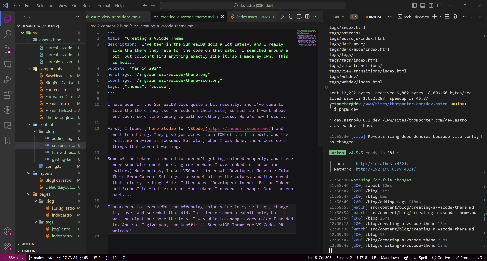
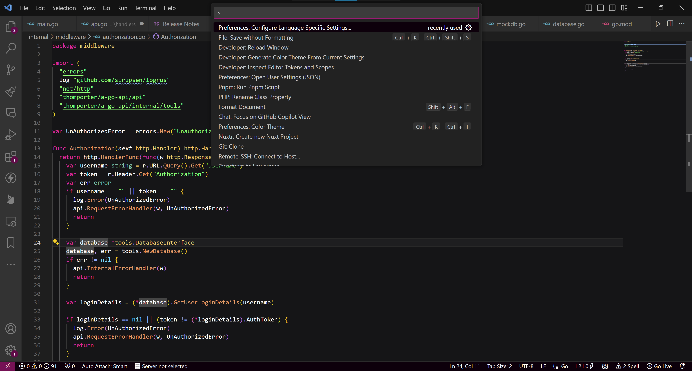
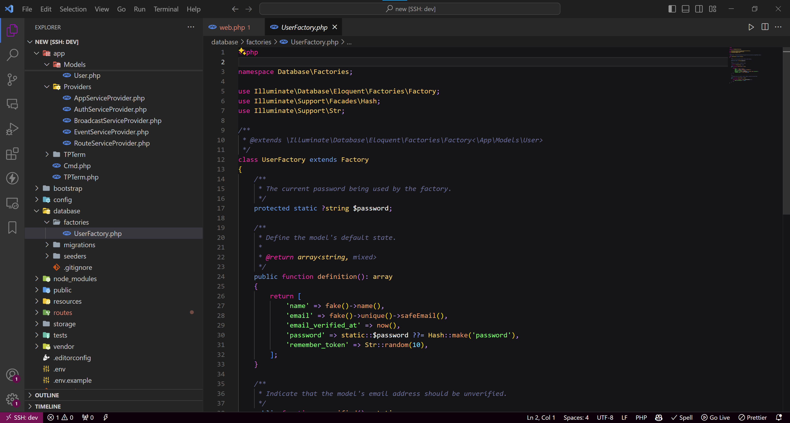

# SurrealDB VSCode Theme (unofficial)

This is a theme for VSCode based on the code theme on the [SurrealDB Documentation Site](https://surrealdb.com/docs/).

PRs welcome at <https://github.com/thomporter/surrealdb-vscode-theme>
